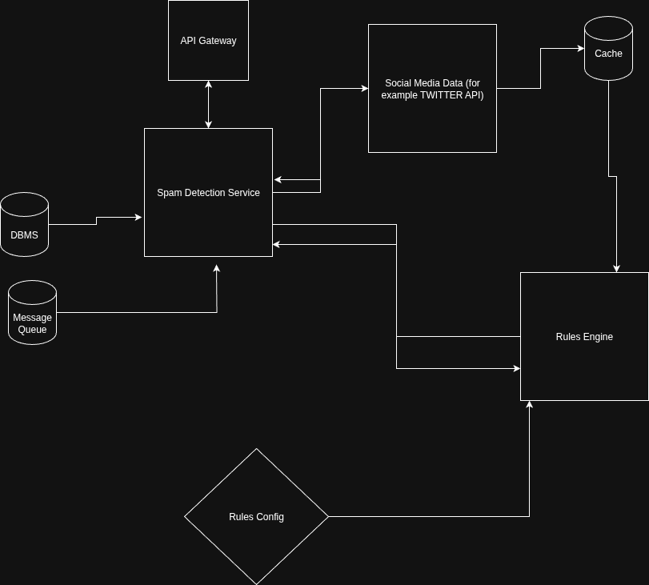

# Spam Detection For Social Media Posting APIs
A small microservice for detecting possible spamming attempts when using social media posting APIs. It uses a rules based approach that can be configured by changing the config JSON.

This implementation supports Twitter. The code is modular and other platforms can be added as an independent service. The SocialMediaService is responsible for using third-party API calls in order to fetch user account and historical data.


## Analysis Criteria
1. The request payload is analyzed for spam keywords, hashtags, and username
2. The request payload is analyzed for excessive URLs
3. User's post history is analyzed for posting frequency
4. User information is analyzed for potential spam in user bio etc. 
5. User's verification status is considered as well


## Response Structure:

````typescript
interface PostAnalysisResult {
  action: SpamDetectionAction;
  confidence: number;
  score: number;
  reasons: string[];
  requestId: string;
  processedAt: number;
}

type SpamDetectionAction = "ALLOW" | "BLOCK" | "FLAG";
````


# How to run

This code is using https://rapidapi.com/davethebeast/api/twitter241 for getting historical user data. You can use the free version to test this service.

The API keys needs to be passed as an ENVIRONMENT VARIABLE.

### env file
1. create ".env" file in the root directory
2. add :
```` 
TWITTER_BASE_URL = "https://twitter241.p.rapidapi.com"
TWITTER_BEARER_TOKEN = "xxxxxxxxxx"
NODE_ENV = "development"
````


To run,
````bash 
docker compose up
````

Then make a request to the ````/detect/```` endpoint


## Curl Request:
````bash 
curl --request POST http://localhost:3000/api/v1/detect \
  --header "Content-Type: application/json" \
  --data '{
    "userID": "NatGeo",
    "content": "congratulations winner, cash prize, no experience needed, investment opportunity, double your money, risk free, bitcoin opportunity, spamHashtags: #followme, #follow4follow, #followforfollow, #followback",
    "platform": "twitter",
    "requestId": "11111111"
  }'
````

## Endpoint for resetting cache.
````bash
 curl --request POST http://localhost:3000/admin/refresh-rules
````

After changing the contents of rules.json, call this endpoint to rest cache.

## Test
```bash 
npm run test
```

# Architecture
This is a rules based spam detection program. It analyzes the current post, historical data from user's post history, and user profile information (please see the structure of rules.json below.) It follows this general flow:
1. API endpoint receives a request to analyze a social media post. 
2. SpamDetectionService, based on the platform (specified in the payload), calls api to fetch user details (via SocialMediaService)
3. RulesEngine then takes the data and evaluates it based on the rules specified in rules.json and returns a response that includes an action (ALLOW | FLAG | BLOCK ) along with the calculated score and a confidence value which indicates how accurate the analysis is likely to be.


## Cache
User history and rules are cached. The TTL for each can be specified in rules.json


## Code Architecture
The code uses a container of services injects these services as dependencies where required. For example, the SpamDetectionService requires:
````typescript
    private rulesEngine: RulesEngine,
    private cacheService: CacheClient,
    private database: any, // not implemented
    private messageQueue: any, // not implemented
    private logger: Logger,
````
as dependencies. Since this is a relatively small service it uses a container registry as opposed to tsinject or nestjs.
These are the main service:
1. SpamDetectionService
2. SocialMedia/twitterService
3. cacheService
4. rulesEngine


# Rules.json
### Main configuration for the rules engine


The list of spam words is put in "rules.json":
```JSON
rules.spamKeywords

rules.spamHasgtags

rules.spamUsernames
```
____
The threshold for considering a score as spam is also specified in the json, along with with the scoring parameters
```JSON

  "thresholds": {
    "block": 80,
    "flag": 50,
    "allow": 49
  }
-----------------------------------------------------------------------------
  "scoring": {
    "weights": {
      "spamKeywords": 8,
      "excessiveUrls": 8,
      "excessiveHashtags": 6,
      "caps": 4.5,
      "userDescriotionSpamKeywords": 6.15,
      "userDescriptionExcessiveHashtag": 5.5,
      "userDescriptionExcessiveUrls": 5.75,
      "userNameSpamyKeywords": 6,
      "isLowFollowers": 25,
      "isUserLowFollowCount": 20,
      "isUserNotVerified": 10,
      "isHistoryPostingOften": 50
    }
  },

```

The properties with the prefix "is" is added to the final score while the rest are multiplied.


Platform specific system rules are also put in this json, foor example, the TTL for storing user post history in the cache.


# TODO:
1. Fine tune rules.json weights
2. Add more words to to the set of spam words
3. Add  messaging queue implementations for deeper analysis of flagged posts
4. Add database entry to allow manual analysis of flagged/blocked posts
5. Add more tests cases for rulesEngine as well as integration and E2E tests for the entire service
